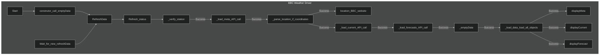

BBC main stream driver

```mermaid 
%%{init: {'theme': 'dark', 'fontFamily': 'Arial'}}%%
flowchart TD
  subgraph "BBC Weather Driver"
    A[Start] --> B[construtor_call_emptyData]
    B --> C[RefreshData]
    D[Wait_for_new_refreshData] --> C
    C --> E[Refresh_status]
    E --> F[_verify_station]
    F -->|Success| G[_load_meta_API_call]
    G -->|Success| H[_parse_location_if_coordinates]
    H -->|Success| I[location_BBC_website]
    H -->|Success| J[_load_current_API_call]
    J -->|Success| K[_load_forecasts_API_call]
    K -->|Success| L[_emptyData]
    L -->|Success| M[_load_data_load_all_objects]
    M -->|Success| N[displayMeta]
    M -->|Success| O[displayCurrent]
    M -->|Success| P[displayForecast]
end

``` 
