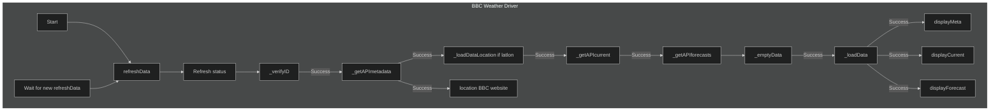

BBC main stream driver

```mermaid 
%%{init: {'theme': 'dark', 'fontFamily': 'Arial'}}%%
flowchart TD
  subgraph "BBC Weather Driver"
    A[Start] --> B[refreshData]
    C[Wait for new refreshData] --> B
    B --> D[Refresh status]
    D --> E[_verifyID]
    E -->|Success| F[_getAPImetadata]
    F -->|Success| G[_loadDataLocation if latlon]
    F -->|Success| H[location BBC website]
    G -->|Success| I[_getAPIcurrent]
    I -->|Success| J[_getAPIforecasts]
    J --> K[_emptyData]
    K -->|Success| L[_loadData]
    L -->|Success| M[displayMeta]
    L -->|Success| N[displayCurrent]
    L -->|Success| O[displayForecast]
end

``` 
