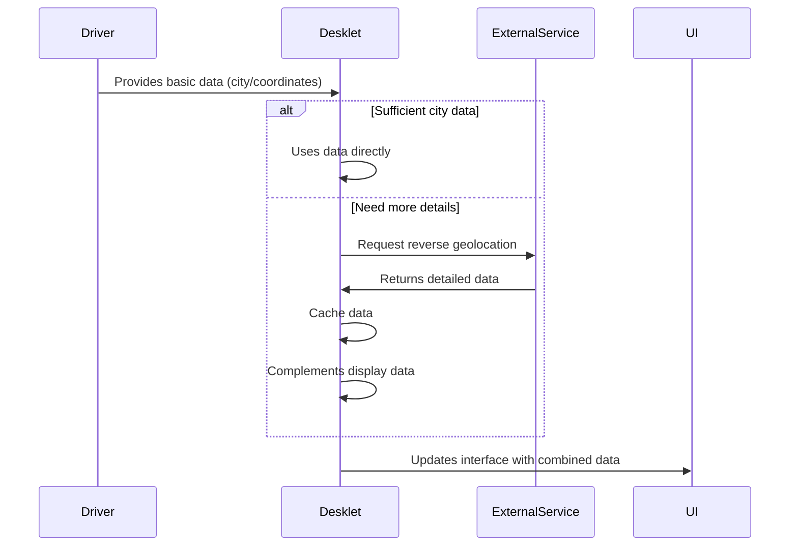

# Analysis of Reverse Geolocation Functions in desklet.js  

## Overview

I will explain in detail how the reverse geolocation system works in the BBC Weather desklet, including the interaction between drivers and the desklet.

## General Operating Flow

1. **Driver (wxbase.js and extensions)**: Provides basic location data (coordinates or city names)
2. **Desklet (desklet.js)**: Can supplement this data with reverse geolocation when needed
3. **External Services**: Yahoo! (deprecated) and Google Maps API (modified, requires apikey from Google Developers) are used for reverse geolocation

## Main Functions

### 1. `_getGeo(locsrc, callback)`

-   **Purpose**: Makes the HTTP request to the reverse geolocation service
-   **Parameters**:
    -   `locsrc`: "yahoo" or "google" (service to be used)
    -   `callback`: Function to process the results
-   **Behavior**:
    -   Constructs the appropriate URL for the selected service
    -   Uses the Soup library to make the HTTP request
    -   Calls the callback with the raw data received

### 2. `_load_geo(data, locsrc)`

-   **Purpose**: Router that decides which specific function to call based on the service
-   **Parameters**:
    -   `data`: Raw data returned by the service
    -   `locsrc`: "yahoo" or "google" (indicates which parser to use)
-   **Behavior**:
    -   Calls `_load_geo_yahoo` or `_load_geo_google` depending on the service
    -   Updates the local cache of geolocations

### 3. `_load_geo_yahoo(data)`

-   **Purpose**: Processes the response from Yahoo! PlaceFinder (deprecated)
-   **Behavior**:
    -   Extracts city and country from Yahoo!-specific JSON structure
    -   Stores in cache (`this._geocache.yahoo`)
    -   Updates display fields (`displaycity`, `tooltiplocation`)

### 4. `_load_geo_google(data)`

-   **Purpose**: Processes the response from the Google Maps API 
    -   Not working due to the change in the API that requires an individual apikey from the Google Developers project
-   **Behavior**:
    -   Parses the complex structure of Google addresses
    -   Attempts to extract information at different levels (locality, city, country)
    -   Stores in the cache (`this._geocache.google`)
    -   Updates the display fields

## Interaction with Drivers

1.  **Initial Data**:
    -   Each driver (BBC, OpenWeatherMap, etc.) provides location data in the format:
    ```javascript
        this.data.city = '';       // City name
        this.data.country = '';    // Country name
        this.data.wgs84 = {        // Geographic coordinates
          lat: null,
          lon: null
        };
        ```
2.  **Processing in Desklet**:
    -   Desklet checks whether to use:
        -   Manual user data
        -   Raw driver data
        -   Reverse geolocation (when there are coordinates but no city name)
    -   When reverse geolocation is activated, driver data is **not overwritten**, but **supplemented** for display

3.  **Font Hierarchy**:
    ```mermaid
    graph TD
      A[Location Source] --> B[Manual Data]
      A --> C[Driver - City Name]
      A --> D[Driver - Coordinates]
      D --> E[Reverse Geolocation]
    ```
## Location Cache

The desklet implements a cache system to avoid repeated queries:
```javascript
this._geocache = {
  yahoo: {},  // Cache for Yahoo! results
  google: {}  // Cache for Google results
};
```

## Data Replacement (???)

-   **There is no direct replacement** of the original driver data
-   The driver data remains intact in the `service.data` object
-   The desklet uses the supplementary data only for display, maintaining a clear separation between:
-   Raw data (driver)
-   Processed data (desklet)

## Complete Flow


## Important Considerations

1. **Yahoo! PlaceFinder**: The service has been discontinued;
2. **Google Maps API**: The API has been modified to use individual apikey, so it doesn't work either;
3. **Efficiency**: Caching avoids repeated queries for the same coordinates;
4. **Data Separation**: The original driver data is never modified, only supplemented for display;
5. **Configuration**: The user can choose between:
- Using weather service data;
- ~~Using reverse geolocation (Google)~~;
- ~~Using reverse geolocation (Yahoo!)~~;
- Manually entering the location;

This implementation allows the desklet to show richer location information even when the weather service only provides coordinates, while maintaining the integrity of the original data.
