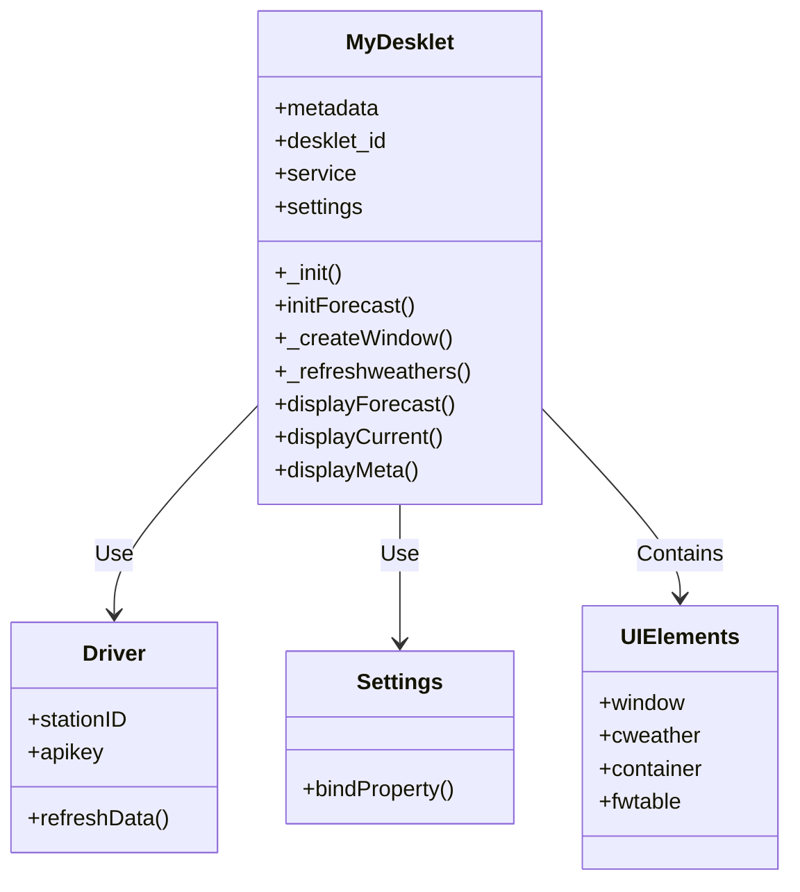
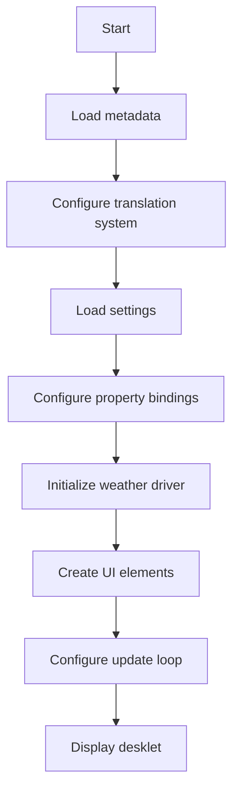
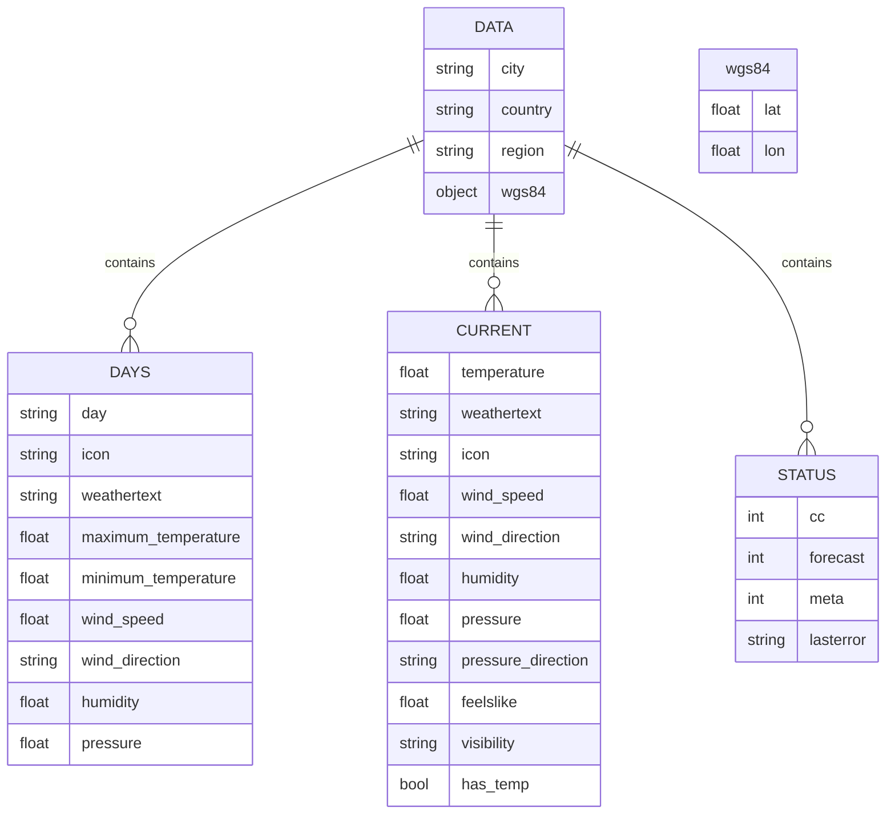
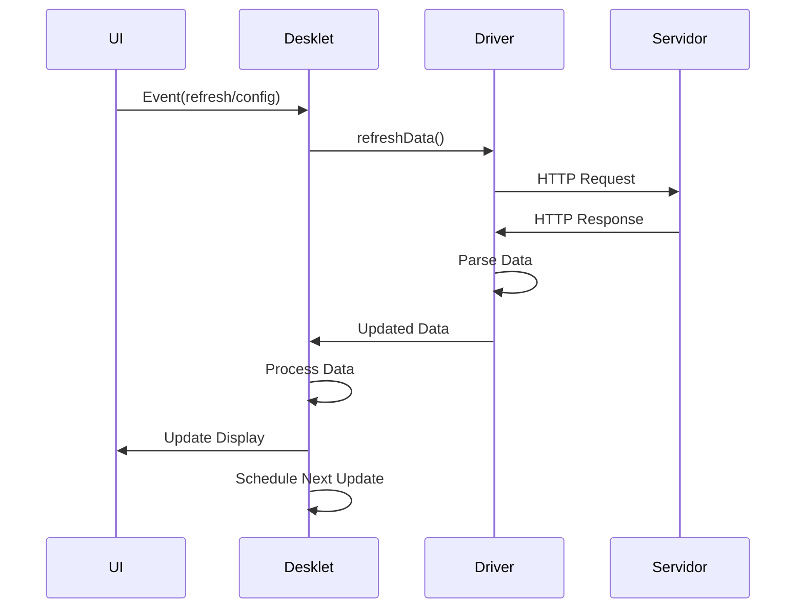
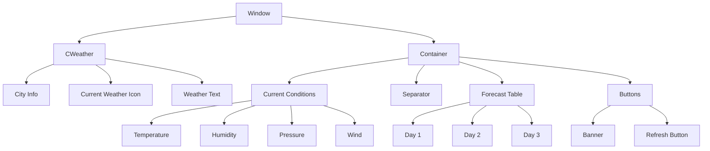
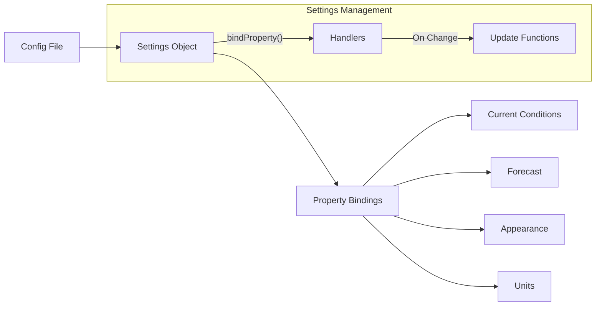
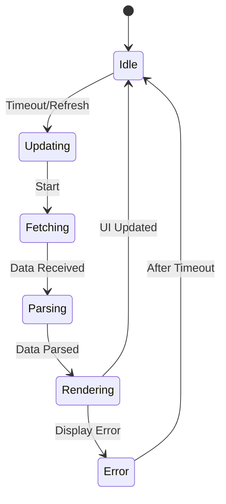

# Expanded Analysis of the Main Structure of Desklet.js

Detailed analysis of the main structure with diagrams, flowcharts and commented code snippets for better understanding.

## 1. Main Component Diagram

The system is architected in four main components that work together:
- **MyDesklet**: Main class that coordinates all operations, inheriting from the base class Desklet.Desklet. Manages the complete life cycle of the desklet.
- **Driver**: Abstract class that defines the interface for the various weather services (BBC, OpenWeatherMap, etc.). Each concrete driver implements the specific logic for its service.
- **Settings**: Responsible for persistent management of user settings, using the Cinnamon settings system.
- **UIElements**: Container for all graphical interface elements, organized hierarchically to allow flexible layouts.

The relationship between these components follows the principle of loose coupling, allowing each part to evolve independently.


## 2. Initialization Flowchart

The initialization process follows a well-defined sequence:
1.  **Load Metadata**: Basic desklet identification and installation paths.
2.  **Internationalization Configuration**: Preparation of the translation system using Gettext.
3.  **Load Settings**: Reading the user's saved preferences.
4.  **Property Bindings**: Establishing reactive relationships between settings and functionality.
5.  **Driver Initialization**: Creation of the specific weather service as selected by the user.
6.  **UI Construction**: Dynamic assembly of the graphical interface based on the driver's capabilities.
7.  **Loop Start**: Triggering the first refresh and preparing for periodic updates.

This sequence ensures that all dependencies are resolved in the correct order before the desklet is displayed.

### Initialization Code Snippet:
```javascript
_init: function(metadata, desklet_id) {
    // Basic configuration
    this.desklet_id = desklet_id;
    this.metadata = metadata;
    
    // Configure translations
    Gettext.bindtextdomain(UUID, GLib.get_home_dir() + '/.local/share/locale');
    
    // Initializes system settings
    this.settings = new Settings.DeskletSettings(this, UUID, this.desklet_id);
    
    // Configure bindings for properties
    this._setupSettingsBindings();
    
    // Initialize the weather driver
    this.initForecast();
    
    // Creates the main window
    this._createWindow();
    
    // Starts the update loop
    this._doLoop();
}
```
## 3. Core Data Structure

The desklet's core data model organizes information into three main groups:
-  **Location Data**: Stores geographic identifiers (city, country, coordinates).
-  **Current Conditions (cc)**: Contains all weather observations for the current moment.
-  **Forecast (days)**: Array with forecasts for the following days, each with its own detailed structure.
-  **Service Status**: Maintains the status of operations (success/error) for each type of data.

This structure is filled in by the driver and consumed by the visualization layer, serving as a bridge between the components.


### Explanatory Text:

The desklet data model is organized into four main interrelated entities:

1. **DATA Entity**:
-   Stores basic geographic information
-   Main fields:
    -   `city`    : Name of the city (e.g. "São Paulo")
    -   `country` : Country (e.g. "Brazil")
    -   `region`  : State/Region (e.g. "SP")
    -   `wgs84`   : Nested object with coordinates

2. **DAYS Entity** (array):
-   Contains forecasts for multiple days
-   Each item has:
-   `day`: Day of the week (e.g. "Mon")
-   `icon`: Weather icon code
-   Numerical measurements (temperatures, wind, etc.)

3. **CURRENT Entity**:
-   Current weather conditions
-   Includes:
-   Primary data (temperature, description)
-   Supplementary data (humidity, pressure)
-   `has_temp`: Flag for data verification

4. **STATUS Entity**:
-   Controls the status of operations
-   Fields:
-   `cc/forecast/meta`: Status codes (0=Error, 1=Loading, 2=OK)
-   `lasterror`: Error message when applicable

5. **wgs84 Object**:
-   Nested structure in DATA
-   Contains:
-   `lat`: Latitude (-90 to 90)
-   `lon`: Longitude (-180 to 180)

This structure allows:
-   Hierarchical storage of weather data
-   Clear separation between current data and forecasts
-   Precise control of the status of each operation
-   Flexibility for future expansion

The 1-to-many relationship between DATE and DAYS (via the `days` array) is particularly important, as it allows the desklet to display forecasts for multiple days in a consistent manner.

## 4. Data Update Flow

The update cycle follows an observer pattern:
1.  **Start Event**: Can be triggered by timeout or user action.
2.  **Driver Request**: The specific weather service is triggered.
3.  **HTTP Processing**: The driver communicates with the remote API.
4.  **Data Parse**: Transformation of the service-specific formats to the internal model.
5.  **UI Update**: Propagation of changes to all visual elements.
6.  **Rescheduling**: The loop perpetuates based on the configured interval.

This flow ensures that the data remains up-to-date with minimal impact on system performance.


### Update Code Snippet:
```javascript
_refreshweathers: function() {
    // Update timestamp
    this._setLastUpdated();
    
    // Calls the driver to update data
    this.service.refreshData(this);
    
    // Updates the display
    this.displayCurrent();
    this.displayForecast();
    this.displayMeta();
    
    // Schedule next update
    this._doLoop();
}
```
## 5. UI Hierarchy

The graphical interface is built as a tree of components:
-  **Window**: Root container that defines the main layout (horizontal/vertical).
-  **CWeather**: Left/top panel with primary information (location, current icon).
-  **Container**: Right/bottom panel with details and forecasts.
-  **Current Conditions**: Shows detailed weather data at the moment.
-  **Forecast Table**: Grid with forecasts for multiple days.
-  **Button Bar**: Area with controls and credits.

This hierarchy allows dynamic reorganizations based on user preferences without the need for complete rebuilding.


### UI Creation Excerpt:
```javascript
_createWindow: function() { 
// Create main container 
this.window = new St.BoxLayout({ vertical: (this.vertical == 1) ? true : false }); 

// Top/left 
this.cweather = new St.BoxLayout({ vertical: true }); 
this.cweather.add_actor(this._createCityDisplay()); 
this.cweather.add_actor(this._createCurrentWeatherIcon()); 

// Bottom/right 
this.container = new St.BoxLayout({ vertical: true }); 
this.container.add_actor(this._createCurrentConditions()); 
this.container.add_actor(this._createSeparator()); 
this.container.add_actor(this._createForecastTable()); 
this.container.add_actor(this._createButtonBar()); 

// Assemble the complete window 
this.window.add_actor(this.cweather); 
this.window.add_actor(this.container); 

this.setContent(this.window);
}
```
## 6. Settings System

Configuration management uses:
-  **Automatic Bindings**: Declarative connections between properties and handlers.
-  **Logical Categorization**:
-  Service Configurations (provider selection, API keys)
-  Display Preferences (visible elements/units)
-  Visual Appearance (colors, sizes, themes)
-  **Change Propagation**: Updates are automatically reflected in the UI without the need for a full refresh.

This system simplifies the maintenance of the application state and ensures consistency between user preferences and desklet behavior.


### Settings Binding Code Snippet:
```javascript
_setupSettingsBindings: function() {
// Service settings
this.settings.bindProperty('webservice', 'webservice', this.initForecast);

// Display settings
this.settings.bindProperty('display__cc__humidity', 'display__cc__humidity', this.displayOptsChange);

// Unit settings
this.settings.bindProperty('tunits', 'tunits', this.onTempUnitChange);

// Appearance settings
this.settings.bindProperty('textcolor', 'textcolor', this.updateStyle);
}
```
## 7. Update State Diagram

The update cycle goes through well-defined states:
-  **Idle**: Resting state between updates.
-  **Updating**: Initial preparation phase.
-  **Fetching**: Active communication with the remote service.
-  **Parsing**: Transformation of raw data to the internal model.
-  **Rendering**: Application of changes to the interface.
-  **Error**: Special state for handling failures.

Each transition includes integrity checks and fallback mechanisms to ensure stability even under adverse network conditions or unavailable services.



### State Treatment Excerpt:
```javascript
service.refreshData(this); // Call to driver

// In the driver:
refreshData: function(deskletObj) { 
    try { 
        deskletObj.data.status = { cc: 1, forecast: 1, goal: 1 }; //INIT 
        this._fetchData(function(data) { 
        if(date) { 
            this._parseData(data); 
            deskletObj.data.status = { cc: 2, forecast: 2, goal: 2 }; // OK 
        } else { 
            deskletObj.data.status = { cc: 0, forecast: 0, goal: 0 }; // ERROR 
        } 
            deskletObj.displayCurrent(); 
        // ... 
        }); 
    } catch(e) { 
        deskletObj._showError(deskletObj, e.message); 
    }   
}
```
## Conclusion

The desklet.js framework is highly modular and organized into well-defined components:

1.  **Core Layer**: Manages lifecycle and coordination between components
2.  **Service Layer**: Interfaces with weather drivers
3.  **UI System**: Dynamic construction and updating of the interface
4.  **State Management**: Controls data flow and errors
5.  **Configuration System**: Reactive bindings for all options

Each component follows the single responsibility principle, while the event and callback system keeps everything synchronized. The architecture allows for easy expansion to new weather services or display types.