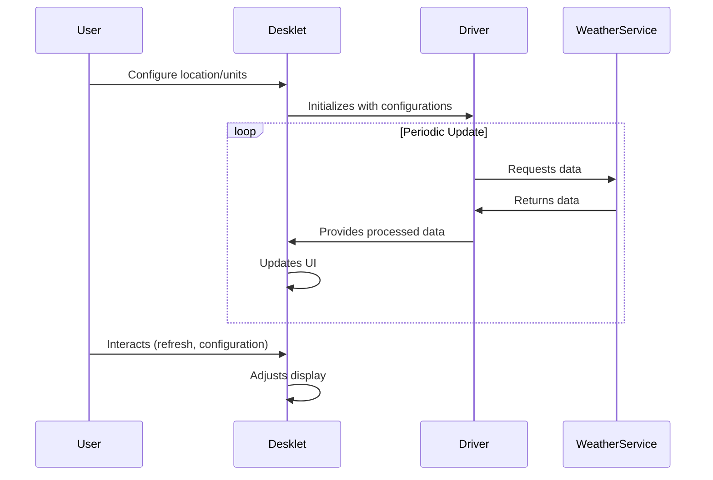

# BBCwx Weather desklet.js Detailed Analysis

Complete and structured analysis of the desklet.js file, which is the main component of the BBCwx Weather desklet for Cinnamon.

## Overview

desklet.js is responsible for:
- Managing the graphical user interface
- Coordinating communication with weather service drivers
- Processing and displaying weather data
- Implementing all user-visible functionality

## Main Structure

### 1. Constants and Initialization

```javascript
const UUID = 'bbcwx@oak-wood.co.uk';
const DESKLET_DIR = imports.ui.deskletManager.deskletMeta[UUID].path;
```
-   Defines unique identifiers and installation paths

### 2. Imports
Imports several necessary libraries:
-   Cinnamon libraries (St, Clutter, etc.)
-   GNOME libraries (GLib, Gio)
-   Weather drivers (BBC, Meteoblue, OWM, etc.)

### 3. Configuration Constants
Defines constants for:
-   Text sizes (BBCWX_TEXT_SIZE, etc.)
-   Spacing (BBCWX_TABLE_ROW_SPACING, etc.)
-   Visual styles (BBCWX_SEPARATOR_STYLE, etc.)

### 4. MyDesklet Main Class
The main class that inherits from Desklet.Desklet and implements all the functionality.

## Main Features

### 1. Initialization and Configuration

```javascript
_init: function(metadata, desklet_id) {
    // Initial setup
    this.settings = new Settings.DeskletSettings(this, UUID, desklet_id);
    // Configuration property binding
    this.settings.bindProperty(Settings.BindingDirection.BIDIRECTIONAL, 'webservice', 'webservice', this.initForecast, null);
    // ... other bindings
}
```
-   Manages persistent configurations
-   Hooks callbacks for configuration updates

### 2. Weather Driver Management
```javascript
initForecast: function() {
    switch(this.webservice) {
        case 'bbc':
            this.service = new BBC.Driver(this.stationID);
            break;
        case 'owm':
            this.service = new OWM.Driver(this.stationID, this.apikey);
            break;
        // ... other services
    }
}
```
-   Selects and instantiates the appropriate driver based on the configuration
-   Each driver implements the specific weather service interface

### 3. Graphical Interface
```javascript
_createWindow: function() {
    // Creates all UI elements
    this.window = new St.BoxLayout({ vertical: (this.vertical == 1) ? true : false });
    // ... building the component hierarchy
}
```
-   Dynamically creates all visual components
-   Organizes into flexible layouts based on configuration

### 4. Data Update
```javascript
_refreshweathers: function() {
    this.service.refreshData(this);
    this._doLoop();
}
```
-   Dispatches weather data update
-   Manages the periodic update loop

### 5. Display Data
```javascript
displayForecast: function() {
    // Updates the forecast display
    for(let f = 0; f < this.no; f++) {
        let day = this.service.data.days[f];
        this.labels[f].text = (this.daynames[day.day]) ? this.daynames[day.day] : '';
        // ... updates other elements
    }
}
```
-   Updates all UI elements with the most recent data

### 6. Reverse Geolocation
```javascript
_getGeo: function(locsrc, callback) {
    // Reverse geocoding via Yahoo/Google
}
```
-   Complements location data when necessary

### 7. Unit Management
```javascript
_formatTemperature: function(temp, units) {
    // Converts between Celsius/Fahrenheit
}
_formatWindspeed: function(wind, units) {
    // Converts between km/h, mph, knots, etc.
}-   Converts units based on user preferences
```
-   Unit conversion based on user preferences

### 8. Style Management
```javascript
_update_style: function() {
    // Applies all visual styles
}
```
-   Applies colors, sizes, and layouts based on configuration

## Operation Flow

1. **Initialization**:
    - Loads configuration
    - Creates UI elements
    - Instantiates weather driver

2. **Data Update**:
    - Driver downloads data
    - Desklet processes and formats data
    - UI is updated

3. **Continuous Loop**:
    - Schedules next update based on configured interval
    - Repeats the process

## Implementation Highlights

### 1. Driver Plugin System
    - Modular architecture allows you to easily add new services
    - Each driver implements a common interface

### 2. Internationalization
    - Extensive use of Gettext for translations
    - Support for multiple languages

### 3. Visual Customization
    - Support for multiple icon sets
    - Detailed appearance configuration

### 4. Smart Caching
    - Geolocation caching
    - Minimizes redundant requests

### 5. Error Handling
    - Robust check of request status requests
    - Fallbacks for when data is unavailable

## Data Flow Example


## Final Thoughts

desklet.js is a robust and well-structured implementation that:
1. Separates clearly the concerns (UI, logic, services)
2. Provides extensibility through the driver system
3. Provides extensive customization options
4. Maintains good performance even with frequent updates
5. Handles errors and edge conditions gracefully

The code demonstrates proper resource management, error handling, and integration with the configuration system.